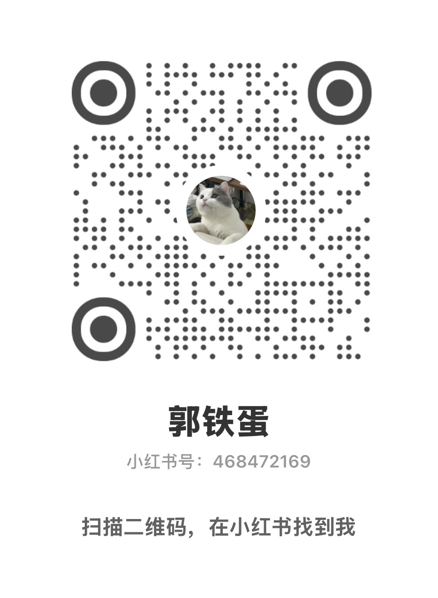

<h1 align="center">郭铁蛋 · Guo Tiedan</h1>

你好，我是郭铁蛋。铁蛋其实是我家的小猫咪。

我写过几年分布式存储系统代码。现在主要在做 AI、开源硬件，还有一些我自己想用、觉得好玩的工具。东西做出来以后，我会把代码、安装方法和踩过的坑放在这里。

*Hi, I'm Guo Tiedan. Tiedan is actually my cat.*

*I spent several years writing code for distributed storage systems. These days I mostly work on AI, open hardware, and small tools I want to use myself. When something is ready, I share the code, setup notes, and the mistakes I made along the way here.*

## 项目 · Projects

- **[YareLampGo](https://github.com/ninsmiracle/YareLampGo)** 
  我正在做的一盏开源桌面 AI 机械臂台灯。它有摄像头、麦克风、电机和屏幕，能看、能听、能动，也能接入 Codex。软件、固件、接线和 V2 结构都在仓库里。 
  *An open-source desktop AI lamp with a camera, microphone, motors, and displays. It can see, hear, move, and work with Codex. The software, firmware, wiring docs, and V2 mechanical design are in the repo.*

- **[Apache Pegasus](https://github.com/apache/pegasus)** 
  一个用 C++ 写的分布式 Key-Value 存储系统。我在这个项目上写过几年代码。 
  *A distributed key-value storage system written in C++. I spent several years working on it.*

- **[Obsidian AI Memory](https://github.com/ninsmiracle/obsidian_memory_template)** 
  给 AI Agent 用的 Obsidian 长期记忆 Skill。我把自己在用的记忆流程整理成了一个更容易安装和复刻的基础版本。 
  *An Obsidian long-term memory skill for AI agents, based on the workflow I use myself and packaged into a simpler version others can set up.*

- **[猫猫霸屏 · Cat Gatekeeper](https://github.com/ninsmiracle/cat-gatekeeper-cn)** 
  刷网站太久，猫就会跳出来挡住屏幕。一个很轻的 Chrome 插件，也可以换成你自己家的猫。 
  *Stay on a distracting website too long and a cat jumps in front of the page. It's a small Chrome extension that you can customize with your own cat.*

## 小红书 · Xiaohongshu / RED

我在小红书也叫 **@郭铁蛋**，主要发这些项目的成品、制作过程和教程。

*I'm also **@郭铁蛋** on Xiaohongshu / RED, where I post demos, build logs, and tutorials for these projects.*

  

  <a href="https://www.xiaohongshu.com/user/profile/5eb5779b0000000001003267?xhsshare=userQrCode">手机正在看？直接点这里 · Open the profile directly</a>

---

**合作 / Collaboration:** [ninsmiracle@gmail.com](mailto:ninsmiracle@gmail.com)
